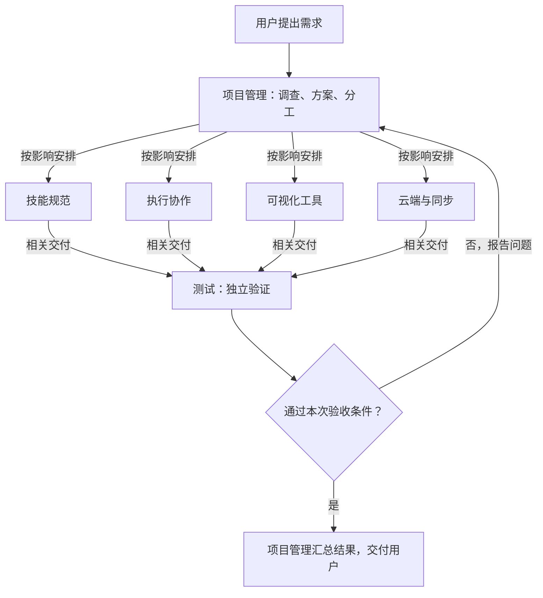

# 用六个角色维护 ANS 技能项目

以后修改 ANS 时，先由项目管理角色判断影响，再交给负责规则、执行工具、展示或云端的角色处理。各角色了解自己的功能和相关上下游，完成实现与单元测试；测试角色再独立检查跨模块和完整流程。

这份方案只划分责任和准备建立的文件。目前没有创建角色卡，没有启动开发代理，也没有修改代码。确认这份方案并授意建立后，再把分工落到具体角色卡和文件边界。

## 先看分工

| 角色 | 对什么结果负责 | 典型任务 |
| --- | --- | --- |
| 项目管理 | ANS 整体架构清楚，跨角色工作有人安排，交付能接起来 | 判断一次规则调整影响哪些工具，设计共同约定，安排实施和验收 |
| 技能规范 | AI 能理解并执行一致的角色、架构和文档规则 | 修改角色模板、工作立场、五层约束、功能文档写法 |
| 执行协作 | 任务能按授权派发，反馈和状态可信，依赖变化能暂停重做 | 修改派发检查、任务状态、反馈协议、版本检查和恢复流程 |
| 可视化工具 | 现有图谱能正确生成、查询和展示，说明与工具能力一致 | 修复旧图谱工具；以后若批准 Markdown 查看页，由它实现 |
| 云端与同步 | Dashboard、账号、项目数据和同步功能按约定工作 | 修改项目 Key、文档历史同步、消息渠道、页面和部署 |
| 测试 | 独立发现跨模块或真实使用流程的问题，并验证修复结果 | 运行完整任务回放，检查执行记录与 Dashboard 的配合，做相关回归 |

这些是长期职责，不要求同时运行六个 Agent。项目管理按任务实际影响安排工作；旧可视化和云端功能仍然是可选能力，有负责人不代表默认启用。

## 每个角色管理哪些功能和文件

### 项目管理

维护整体架构、角色间的接口设计、任务安排和验收记录。默认聊天中由它调查问题、解释方案、安排其他角色。

新资料放在 `角色卡/项目管理/docs/`，其中 `architecture.md` 说明整体结构并链接各角色的 `feature-map.md`。共享组件清单放在自己的 `docs/architecture/shared-components.md`；出现经过确认的跨角色基础代码需求时，由它编写 `common/shared/` 和对应测试。当前仓库没有这一组共享组件，这次不为分工先抽代码或建空框架。

它不修改其他角色的代码、单元测试和权限。现有根目录 `doc/` 的 42 份记录由它负责索引和保留，默认只读。当前这份初始化方案沿用已有根目录 `doc/design/`，以后从项目管理的资料里链接回来，不搬动历史文件。

项目管理没有直接提供给技能使用者的独立业务功能时，功能导航写明这一点，不把“安排任务”凑成产品功能。

### 技能规范

管理 ANS 对外提供的规则和说明：

1. 根据需求建立使用者项目的角色、边界和分工。
2. 按五层约束组织设计与实现，控制 common 代码的归属。
3. 先交方案、得到实施授权，再进行代码修改。
4. 用功能导航、流程图和历史链接解释项目。
5. 让各角色从正式项目长期维护者的立场工作。

主要文件是 `SKILL.md`、`SKILL.zh.md`、根 README，以及角色、架构、文档等通用 `references/*.md`。执行、展示、云端能力的专用指南由相应能力角色维护，技能规范负责协调入口和发现表述冲突，不包办所有说明。

`test/documentation-samples/` 是旧写法示例，先作为只读参考保留。若要更新示例，另列具体修改范围，不能把旧示例当成现行规则。

### 执行协作

管理以下工具功能：

1. 初始化任务并固定已审核的配置和方案版本。
2. 检查授权和依赖，派发任务、接收确认。
3. 运行约定检查，接收反馈并验证完成状态。
4. 方案变化后暂停、停止、重新派发相关任务。
5. 保存事件与状态，发生中断时恢复任务记录。
6. 为新项目提供现有的 shell/PowerShell 目录初始化入口。

主要实现为 `scripts/task_ops.py`、`scripts/coordination_store.py`、两份 scaffold 脚本；对应指南是 `references/task-operations.md`、`references/scheduler.md`、`references/coordination.md`。`scripts/tests/test_task_ops.py` 归它维护。

它维护的是“提供给使用者的任务调度工具”。它不能据此派发 ANS 项目其他角色；本仓库的任务安排仍归项目管理。`.gitignore` 和本地 CLI 的工程接线也归它。

### 可视化工具

管理已有三组功能：

1. 旧代码图谱的扫描、查询和展示。
2. 旧角色功能图谱的生成和步骤查看。
3. 旧架构 JSON 到离线 HTML 的生成。

对应实现为 `scripts/sync_atlas.py`、`scripts/query_atlas.py`、`scripts/role_atlas.py`、`scripts/render_architecture.py`，以及 `assets/` 下的实际页面文件。它维护对应指南、测试、DOM 检查助手和架构示例夹具。

当前默认功能说明已经改成 Markdown。现有 JSON 绘图器不能读取新的 Markdown；这个角色的建立不代表已经实现 Markdown 查看页。未来需要该功能时，先写方案再实现。

### 云端与同步

管理已有功能：

1. 本地或云端 Dashboard 展示。
2. 账号登录、管理员操作、项目及项目 Key。
3. 项目配置、数据存储、手动同步、冲突提示和文档历史。
4. 角色消息及申请渠道。
5. 保留的项目理解、旧同步命令及运行状态检查。
6. 容器部署、路径前缀及已提供的更新脚本。

`dashboard/` 下的代码、页面、配置样例和部署文件由它维护。`scripts/serve_dashboard.py`、`scripts/context_store.py`、`scripts/check_dashboard_sync.py` 虽然在 scripts 目录，本质上是这一能力的入口，也归它。相关指南和单元/HTTP 测试跟随同一负责人。

这只是文件归属方案，不启动服务、不修改线上数据、不部署，也不恢复自动同步。后续功能说明必须区分默认手动同步和保留的旧工具。

### 测试

各开发角色保留自己的单元和能力测试。测试角色可读取并独立运行这些测试，但不能为了通过而改掉别人的断言。

它现有的可维护入口是 `scripts/validate_task_flow.py`，以及所用的 `scripts/tests/helpers/timer_regression.cjs`、`scripts/tests/fixtures/timer-repair.json`。这组工具在隔离副本中回放真实样例的发现问题、改设计、暂停、重做和验证过程；它不启动真实的多 Agent 团队，也不证明浏览器或操作系统权限隔离已经验证。

`test/game-engine/` 的 95 个文件是这套回放和图谱测试的历史基线，其中的角色卡只管理该示例。它们不成为 ANS 自身的角色，默认保留只读。测试角色负责识别基线依赖和报告问题；不能通过修改原样例或修复夹具把失败隐藏起来。确需更新基线时，再单独说明理由和影响。

后续跨模块测试放在明确授权的测试文件中，不提前生成空测试。发现问题后，测试角色报告复现步骤和差异，项目管理安排代码所属角色修复，再由测试角色复测。

## 文件归属不是按目录整块分配

已清点当前 GitLab 基线 `a0ba8e9` 的 247 个已跟踪文件，每个都列入[文件归属候选清单](2026-09-30_design_ans-project-file-ownership.md)。

| 角色 | 当前拟按任务维护 | 历史/样例只读保留 |
| --- | --- | --- |
| 项目管理 | 0 个现有文件；管理资料确认后建立 | 42 |
| 技能规范 | 31 | 5 |
| 执行协作 | 9 | 0 |
| 可视化工具 | 19 | 0 |
| 云端与同步 | 43 | 0 |
| 测试 | 3 | 95 |

这里的数量只帮助查漏，不用文件数决定角色大小。正式源码边界逐文件列出，不给一个角色整个 scripts/ 或所有 tests/。同一份测试文件可能包含单元和集成场景，当前先保持唯一维护者，测试角色独立执行和报告，不为分角色拆文件。

仓库有本地 CLI 和 Dashboard 两类入口，装配职责跟随其维护者：执行协作负责本地工具入口，云端与同步负责 Dashboard 的启动与部署配置；独立完整流程验证归测试角色。本方案把装配职责分配给现有角色，不新增第七个角色。

GitHub 对应基线为 `075c7a4`，比 GitLab 多一份 Apache-2.0 `LICENSE`。它作为只读发布资料保留。两个仓库 README 的安装地址差异继续保留。以后用户要求发布时，由项目管理协调已验证内容的镜像发布和安装；代码维护权限不自动授予推送或部署权限。

## 六个项目角色与内置治理怎么分开

ANS 同时是“供别人使用的技能”和“正在被维护的项目”，需要分清这两个身份：

- `SKILL.md` 和 `references/` 是交付给使用者的产品内容，由上面的对应角色维护。
- 本仓库的 `角色卡/*/role-card.md`、`boundary.md`、本地权限配置和入口指引，由内置 ANS 治理维护。它只负责角色和权限，不再和技能规范角色同时拥有产品规则文件。

确认后拟新增 `角色卡/governance-boundary.md`，作为本仓库对内置治理默认边界的明确覆盖。拟新增根 `AGENTS.md`，简要链接这个本地治理边界、项目管理角色和角色导航；不会再复制整套技能，也不会自动开启所有角色的执行权限。这个本地覆盖只管 ANS 仓库，不能写进通用模板强迫其他使用者照搬。

修改产品中的规则文字，不会自动扩大当前仓库角色已批准的权限。需要变更本仓库分工或权限，仍由项目管理提出、内置治理处理，并遵守已有用户确认要求。

## 角色之间怎么配合



这张图表达责任流，不表示每个任务都要经过全部开发角色，也不是代码运行时调用图。

当前已核对的关键连接：

| 连接 | 已有依据 | 变更时怎样配合 |
| --- | --- | --- |
| 规则 → 执行工具 | 任务、授权和版本规则由 references 说明，task_ops 检查相应数据 | 规则角色写清行为，执行协作确认工具是否真的支持 |
| 执行记录 → Dashboard | dashboard/server.py 读取 plan/state/events | 执行协作与云端角色共同确认字段和版本，测试角色验证展示结果 |
| 旧图谱 → Dashboard | server.py 导入 role_atlas 并提供旧图谱页面 | 可视化维护生成和页面资源，云端维护服务入口，两边各改自己的文件 |
| 执行工具 → 验证回放 | validate_task_flow.py 调用 task_ops 与 coordination_store | 执行协作修改工具，测试角色调整获准的回放用例并验证实际结果 |

例如，以后要给任务反馈增加一个展示字段：项目管理先确认用途和兼容影响；执行协作维护数据与写入；云端角色调整读取与页面；需要改变用户规则时技能规范参与；测试角色跑完整链路。任何角色发现需要修改别人的文件，都把请求交回项目管理。

## 确认后具体建立什么

拟建立以下六个目录：

```text
角色卡/
  governance-boundary.md
  项目管理/
  技能规范/
  执行协作/
  可视化工具/
  云端与同步/
  测试/
```

1. 内置治理按照本方案建立各角色的 role-card、boundary 和角色建立记录，明确工作立场、职责与实际文件白名单。源码清单从附件逐条落实，不使用宽泛目录替代。
2. 每个角色根目录使用 `feature-map.md`，角色资料使用 `docs/`。只有有实际内容时才建立相应文件，不生成一堆占位文档。当前功能写进稳定的 `docs/feature/<功能名>.md`，包含用途、流程图、步骤、分支及真实历史链接。
3. 项目管理维护自己的 `docs/architecture.md`；相关角色把已有根 doc 历史链接进自己的功能文档，不删除旧记录，也不额外维护 JSON。
4. 核对全部文件唯一归属、只读基线没有进入白名单、必读资料和相对链接有效、图与实际入口一致。不存在的功能标计划中或不列，不把旧 HTML 写成已支持 Markdown。
5. 汇报实际建立的角色和仍待核实的功能说明。这里只初始化管理结构，不借此改业务实现、搬迁目录、更新服务器或扩大未来任务授权。

当前方案是六个角色的职责与初始化范围候选。确认后可在授权范围内顺序建立，角色的激活和资料编写沿用同一范围的明确授权；后续任务仍按自身范围检查，不把这次初始化理解为永久自动派发所有任务。

## 如何确认方案落地

- 文件清单与当前 Git 基线逐项比较，无遗漏、无重复归属；新增治理资料另列路径和维护者。
- 开发角色只能修改自己的产品文件与单元测试；测试角色不能修改他人的实现；项目管理不取得全部源码权限。
- 通用技能的规范文件与本仓库治理文件区分清楚，本地权限覆盖不成为对外通用规则。
- 功能导航能进入当前功能，再进入对应历史，历史也能返回功能；全部使用既有角色 docs 约定。
- 初次建立角色卡不改程序，不因此重复运行整套代码测试。后续修改实现时，由对应角色运行相应检查，再由测试角色完成本次需要的独立验证。

本轮已完成目录与 Git 文件清点、关键工具入口和跨模块依赖核对；没有逐函数审计所有实现，也没有运行程序测试。两份方案文件之外没有修改仓库内容。还没创建这些角色，等客户确认并授意按本方案建立。
