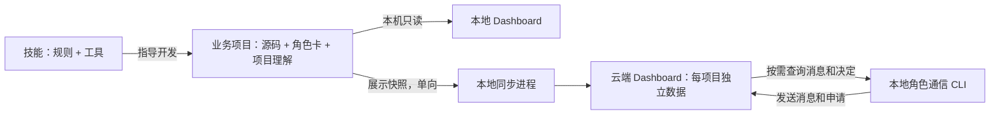

# ANS Skill 怎么工作

这份文档只讲主线。**ANS Skill 是开发规则和工具的集合，不是业务项目，也不是云端服务。**其中有两条不同的约束：**角色边界决定谁能改哪些文件；五层架构决定代码之间怎么调用。**Dashboard 只展示记录。项目可以只在本地开发；需要共享查看时再接云端。

## 1. 先分清三个位置

| 位置 | 放什么 | 主要作用 |
| --- | --- | --- |
| **技能目录** `ans-skill/` | `SKILL.md`、`references/`、`scripts/`、`dashboard/` | 给 AI 规则和可执行工具；多个业务项目共用一份 |
| **业务项目目录** | 源码、`角色卡/`、`docs/`、`project-context/context.sqlite3`、可选的 `.ans-dashboard.local.json` | 实际开发、测试和本地项目理解；一个业务项目一份 |
| **云端 Dashboard** | 用户与 Key 元数据、各项目独立的 SQLite 展示数据和协作记录 | 登录查看多个项目；不运行项目源码或 AI 角色 |



**关键区别：**本地 Dashboard 直接读业务项目文件；云端 Dashboard 只看同步后的展示快照。同步是**本地 → 云端**。服务器上的消息、申请和管理员决定可以通过 CLI 查询，目前不会自动回写本地项目数据库、源码或任务授权。

## 2. 开发一个功能时发生什么

1. **确定角色与边界。**新项目先由内置 ANS Governance 建立角色卡和 `boundary.md`；候选边界需要客户接受。项目默认角色负责总体调查、架构与角色间设计；能力角色写自己拥有的代码；装配角色写根入口并做整体验证。一个聊天框可调查问题，多角色开发需要逐个授权或已有客户批准的配置。角色卡说明职责，**`boundary.md` Section 1 才是可写文件清单**。
2. **角色开始工作前做同步预检。**每个角色卡都运行 `scripts/check_dashboard_sync.py --root <项目目录>`。未配置云端时提醒并询问一次是否需要；已配置但同步器停止时报告；运行中复用。`running=true` 只代表本机进程还在，仍要看 `lastSuccessAt` 和 `lastError`。
3. **按五层职责设计和实现。**构建顺序通常是 `Model → Provider → Service → Pipeline → Interface`；根 `main` 文件只负责启动 Interface。运行调用方向是 `Interface → Pipeline → Service → Provider`，每层只调用相邻下一层，Model 可被共享。新建或明确重构的 Provider 和 Service 使用 `abstract/` 契约、`impl/` 实现、`public/` 唯一对外入口；已有项目不因使用技能就自动迁目录。`utils/`、`resource/`、`test/`、`docs/` 只是辅助目录，不增加架构层；简单功能无需每层都新增文件。
4. **验证受影响的层，再接上层。**角色写自己的测试和带日期的设计、功能、修改或修复文档；实际成功/失败、文件范围和版本构成证据。不涉及的层无需为了凑齐五层而新增文件或测试。项目角色管理跨角色依赖。若要建立阶段计划、派发和验收记录，必须通过 `task_ops` 和客户审阅的配置哈希；它写入 `plan.json`、`state.json`、`events.jsonl` 并生成 `board.md`，但不自动启动代理。已授权的独立单角色任务可以不建调度图。
5. **装配与展示。**装配角色跑根入口和端到端测试。项目角色被接受后就可启动本地 Dashboard，在开发过程中查看真实角色、项目理解、阶段任务和协作事件；没有调度记录时，任务视图保持空白，不会编造状态。

五层规则和角色边界的细节分别在[架构约束](../../references/architecture.md)、[角色卡](../../references/role-card.md)和[项目角色](../../references/project-role.md)。旧的全项目代码图谱默认关闭，只有明确要求时才生成。

| 你要做的事 | 需要的部分 |
| --- | --- |
| 在本地开发一个功能 | 已接受的角色边界、受影响层的代码/测试、相应文档；本地 Dashboard 默认可用 |
| 让多人查看或跨项目沟通 | 在上一行基础上配置云端项目 Key 与本地同步器 |
| 记录可审计的阶段派发与验收 | 再接入经过客户审核配置的 `task_ops`；不能凭角色卡或云端 Key 自动启用 |
| 查看旧式全项目代码图谱 | 只有明确要求时才生成；普通开发不需要 |

## 3. 项目理解、任务记录、文档各管什么

| 内容 | 本地位置 | Dashboard 里看到什么 |
| --- | --- | --- |
| 角色职责与可写边界 | `角色卡/<role>/role-card.md`、`boundary.md` | 角色卡、职责与边界 |
| 当前项目理解 | 一份 `project-context/context.sqlite3`，用 `role_id` 区分角色 | 流程、数据、接口、定义总览与详情；流程可直接显示触发、输入/输出和相关接口 |
| 执行与版本记录 | `docs/scheduling/<task>/plan.json`、`state.json`、`events.jsonl`、`board.md` | 阶段任务、协作事件与验收状态 |
| 历史与设计依据 | 根 `docs/` 和角色自己的 `docs/`，文件名带日期 | 当前 Dashboard 只可直接打开角色目录根部的角色卡、边界、API、功能说明和变更日志；带日期的记录仍在文件中 |

项目理解是**当前导航索引**，文档是**设计与变更历史**，任务记录是**执行状态**。三者不互相替代。项目理解中的按钮点击属于流程触发条件；协作事件记录任务与设计变化，不记录每次按钮点击。带日期文档有生成时间线所需的元数据，但当前没有默认自动生成的时间线页面。详见[项目理解格式](../../references/project-context.md)、[文档规则](../../references/documentation.md)和[任务操作协议](../../references/task-operations.md)。

## 4. 什么时候需要云端，怎样接入

只在自己电脑看项目时，启动本地 Dashboard 即可，**不需要账号或 Key**。多人查看、跨项目总览或角色云端通信时，再部署云端 Dashboard，并按以下顺序接入：

1. 在**本地业务项目**确定稳定的项目 ID，例如 `orders`。
2. 云端管理员在 `/manage` 用这个 ID 创建项目 Key。服务器会登记项目；首次同步前显示“待同步”。同项目角色共用这个 Key，各自声明角色 ID；服务器验证项目 Key，不能独立证明是哪位角色。
3. 在业务项目根目录建立私有 `.ans-dashboard.local.json`。初始化命令隐藏输入 Key；文件权限为 `0600`。若此时项目已是 Git 仓库，工具会写本地 `.git/info/exclude`；若后来才初始化 Git，需要自行忽略该文件。
4. 本地同步进程可单次运行，也可用 `--interval 10` 独立运行、每约 10 秒上传一次。临时网络故障和服务器 5xx 会重试；认证失败等不可重试 4xx 会停止。重复启动同一项目的持续同步器会被拒绝。

以下命令都从**技能目录**运行。每打开一个新终端都先进入技能目录，再把示例绝对路径换成自己的项目路径；本地 Dashboard 和持续同步都会占用当前终端，所以分别在终端 A、B 运行。

```sh
# 终端 A：预检并启动本地只读 Dashboard
PROJECT_ROOT="/absolute/path/to/business-project"
python3 scripts/check_dashboard_sync.py --root "$PROJECT_ROOT"
python3 -m dashboard.server --root "$PROJECT_ROOT" --port 0
```

需要云端时，在**终端 B**运行；`PROJECT_ROOT` 是新终端里的变量，要重新设置：

```sh
PROJECT_ROOT="/absolute/path/to/business-project"
# 只初始化一次；命令会交互读取 Key
python3 -m dashboard.local_config init \
  --root "$PROJECT_ROOT" --project-id orders \
  --server-url https://dashboard.example.com/ans-dashboard

# 持续同步；Ctrl+C 停止
python3 -m dashboard.sync --root "$PROJECT_ROOT" --interval 10
```

要查询云端消息，在**另一个技能目录终端**运行：

```sh
PROJECT_ROOT="/absolute/path/to/business-project"
python3 -m dashboard.channel_cli --root "$PROJECT_ROOT" --role orders list
```

| 会上传到云端 | 不会随快照上传 |
| --- | --- |
| 角色名称与职责摘要、边界路径、项目理解条目、任务状态与协作事件 | 业务源码、完整仓库、角色文档全文、本地 `context.sqlite3` 文件、项目 Key |

云端按项目保存 `projects/<project-id>.sqlite3`，另用 `dashboard.sqlite3` 保存用户、项目和 Key **哈希**。网页登录用户默认可查看全部项目；Key 只对所属项目有效。云端管理员的权限申请决定是一条协作记录，**不自动授权本地 `task_ops` 写代码**。部署、Key 和 API 细节见[Dashboard 说明](../../dashboard/README.md)。

## 5. 常见情况

1. **角色预检说未配置。**先问用户是否需要云端；不需要时继续本地开发，同一项目不要每换一个角色就重问。
2. **预检说运行中，但云端没更新。**看 `lastSuccessAt` 是否新、`lastError` 是否为空，再检查网络和项目 ID；“进程活着”不等于“上传成功”。
3. **云端有消息，本地看不到文件。**当前是单向展示同步；用 `dashboard.channel_cli ... list` 查询云端消息，系统不会自动把它写回本地 SQLite。
4. **阶段任务为空。**项目尚未产生有效的 `task_ops` 计划和状态时，Dashboard 就是空的；角色卡和项目理解仍可正常显示。
5. **关闭电脑后同步停了。**`--interval` 是当前终端进程，不是开机服务。需要常驻时再用系统进程管理器托管，不要同时启动第二份。
