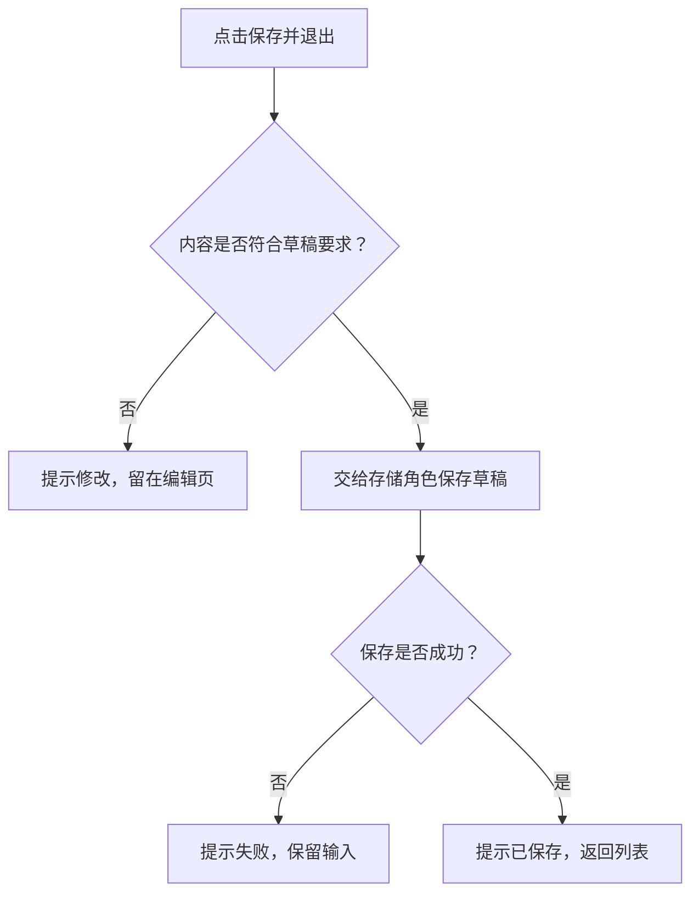

# 功能文档：先讲用途，再讲怎么做

每个开发角色在自己的 `docs/feature/<feature-id>.md` 维护一份功能说明，使用稳定文件名，不加日期前缀。沿用角色已有的 `docs/`，不新增 `doc/`。不再另建角色根目录的 `features/`，也不维护架构 JSON。

功能点是用户或外部系统能触发并得到结果的行为，例如“保存工单草稿”。“写 Service”“负责测试”是角色工作，不是系统功能。一个功能指定一个主要负责角色，其他角色通过链接说明自己的参与，不复制整份功能说明。

## 功能导航：`feature-map.md`

角色根目录的 `feature-map.md` 是唯一的功能导航，列出功能名称、一句话用途、当前状态和相对文档链接。角色卡链接这份导航，不再重复维护完整功能列表。角色自己在已接受的职责和文档范围内维护导航；新增职责、转移功能归属或扩大权限，仍交给项目管理和治理流程。

尚未建立文档的计划功能写“计划中，待补文档”，不用失效链接。没有直接负责的系统功能就写明，不为项目管理或测试角色编造功能点。

## 每份功能文档的顺序

1. **这个功能干什么。**谁在什么情况下使用，解决什么问题，完成后得到什么。开头用大白话，不用类名和文件名代替用途。
2. **现在怎么做。**先说明触发入口、关键输入和结果，再用 Mermaid 流程图画出实际步骤、判断条件和分支，配短句解释。成功、失败、取消、重试等分支按真实行为记录；没有的分支不编造。
3. **在哪里核对。**列主要代码入口、接口和数据约定。网络接口写方法与 URL，内部接口写公开入口，细节链接已有契约。实际验证结果简短说明，没实现或没核实就直说。
4. **演变历史。**按时间追加日期、类型、状态、变化摘要和详细文档链接。链接本角色 `docs/design/`、`docs/change/`、`docs/fix/`；跨角色事项链接项目管理角色那一份，不复制。

流程图中的节点写“保存工单”“提示补充信息”等动作，判断写“内容是否完整？”。调用其他角色时说明“交给谁做什么、传什么、返回什么”，并在正文链接对方的功能文档或正式接口。图和步骤说明同一次更新，不能出现图走成功、文字却说失败的矛盾。

## 写法示例

下面是虚构示例，只说明组织方式。实际项目先核对源码、测试和接口；图中分支和历史日期不能直接复制。

````markdown
# 保存工单草稿

负责角色：工单。状态：已实现。

## 这个功能干什么

客服暂时不提交工单时，保存已填内容，之后可以接着编辑。

## 现在怎么做

客服在编辑页点击“保存并退出”。输入为工单编号和当前填写内容。



保存时把工单编号和内容交给存储角色。成功后返回保存结果；失败时留在当前页面，客服可以修改后再次保存。

## 在哪里核对

- 请求：`POST /api/tickets/{id}/draft`。
- 源码入口：`src/interface/ticket-editor.js`。
- 验证：已检查成功保存和保存失败两种实际结果。

## 演变历史

| 日期 | 类型 | 状态 | 变化 | 详细文档 |
| --- | --- | --- | --- | --- |
| 2026-09-01 | 设计 | 已实施 | 确定草稿保存流程 | [最初设计](../design/2026-09-01_design_save-draft.md) |
| 2026-09-12 | 修改 | 已实施 | 保存前检查草稿内容 | [草稿检查](../change/2026-09-12_change_validate-draft.md) |
| 2026-09-30 | 修复 | 已验证 | 保存失败时保留输入 | [失败处理](../fix/2026-09-30_fix_keep-input.md) |
````

## 当前行为和历史版本

功能主体保持最新，历史记录持续追加。设计、修改和修复文档也反向链接 `../feature/<feature-id>.md`；涉及多个功能就逐项链接。历史文档解释那次为什么改、改前改后怎样，不能随着后来的实现一起改写成最新说明。

待实施、被取消或待验证的方案在历史表里如实标注。已有功能的当前流程不能提前换成未实施的方案。新功能尚未实现时可先写明确标为“计划中”的功能草稿；复杂设计放进 `design/` 并互相链接，客户确认同版方案并授意实施后再改业务代码。完成后核对实际行为、更新功能文档与导航，并追加对应历史条目。

新增功能直接建立这份稳定文档，不再另写日期版 `feature` 文档。历史表可记录首次建立这一行；需要说明设计取舍时链接设计记录，不为凑历史强行补一份重复文档。精确恢复某次完整文档和代码使用 Git，历史链接本身不冒充代码快照。

## 现有项目怎样调整

在已批准的迁移范围内，把旧 `features/` 中的当前说明归入角色现有 `docs/feature/`，保留有效的设计与修改历史、修正引用。原有带日期的新增记录作为历史保留并链接，不再继续生成第二套。旧 JSON 或历史 HTML 不自动删除，也不继续作为必需维护项。没有迁移授权时说明现状，不能直接重写已有角色边界或批量移动文件。
