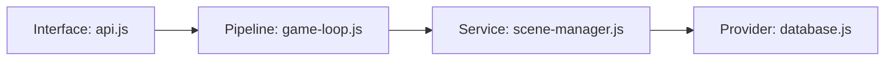

# Functional Description (功能描述)

A companion document to `boundary.md`. It contains architecture diagrams, key code locations, and detailed explanations — everything that is NOT the mutation whitelist.

## Structure

````markdown
# Functional Description: <Role Name>

## Architecture Diagram

<!-- Mermaid or ASCII diagram showing call flow, dependencies, and layers -->



## Key Code Locations

| What | Where |
| --- | --- |
| Entry point | `src/interface/api.js:12` — `handleRequest()` |
| Core logic | `src/services/appointment.js:45` — `createAppointment()` |
| Provider call | `src/providers/database.js:22` — `DatabaseProvider.query()` |

## Detailed Explanation

### How it works

Step-by-step description of the capability's behavior, data flow, and edge cases.

### Ownership

| File | Layer | Permission |
| --- | --- | --- |
| `src/services/appointment.js` | Service | Exclusive |
| `src/providers/database.js` | Provider | Shared |

### Cross-Module Notes

Coordination points with other roles, shared contracts, and event schemas.

````

## Rules

- Updated by the owning role whenever the architecture changes.
- The assembly role does not need to read this file — it reads `api-spec.md` instead.
- Diagrams are required — use Mermaid for renderable diagrams, ASCII for simple flows.

## See also

- [Module boundary document](module-boundary.md)
- [API spec](api-spec.md)
- [ANS Governed Construction SKILL.md](../SKILL.md)
## Optional Interactive Walkthrough

When the user requests it, use [role-atlas.md](role-atlas.md) to turn described features into role-scoped overviews and source-anchored, declarative step sequences. Keep normal/error scenarios, assumptions and current-code discrepancies explicit. This does not automatically run on every implementation task.
