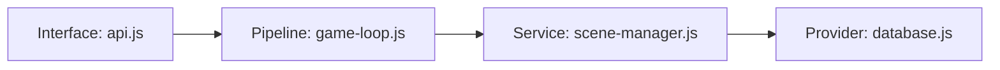

# Functional Description (功能描述)

A companion document to `boundary.md` for role-local module notes and key code locations. Link `feature-map.md` for the role's system features; each feature's current behavior and flowchart live only in its stable [`docs/feature/<feature-id>.md`](feature-point.md). Do not duplicate the feature index or full flows here.

Project management owns overall architecture and role collaboration in its own docs/architecture.md. This companion explains local implementation context only where useful; link public contracts and feature descriptions rather than maintaining another full architecture or understanding index. No architecture JSON is required.

## Structure

````markdown
# Functional Description: <Role Name>

## Architecture Diagram

<!-- Mermaid or ASCII diagram showing call flow, dependencies, and layers -->


```mermaid
flowchart LR
  A[Interface: api.js] --> B[Pipeline: game-loop.js]
  B --> C[Service: scene-manager.js]
  C --> D[Provider: database.js]
```

## Key Code Locations

| What | Where |
| --- | --- |
| Entry point | `src/interface/api.js:12` — `handleRequest()` |
| Core logic | `src/services/appointment.js:45` — `createAppointment()` |
| Provider call | `src/providers/database.js:22` — `DatabaseProvider.query()` |

## Detailed Explanation

### How the role's modules fit together

Explain the shared architecture and data handoffs here. Link each owned system feature's `docs/feature/<feature-id>.md` for its trigger, complete flow, branches and results.

### Ownership

| File | Layer | Permission |
| --- | --- | --- |
| `src/services/appointment.js` | Service | Exclusive |
| `src/providers/database.js` | Provider | Shared |

### Cross-Module Notes

Coordination points with other roles, shared contracts, and event schemas.

````

## Rules

- Updated by the owning role whenever the architecture changes.
- The assembly role does not need to read this file — it reads `api-spec.md` instead.
- Link the project architecture and feature flows as the current diagrams. Add local implementation notes only when they explain something not already covered; do not create a duplicate flowchart or JSON index.

## See also

- [Module boundary document](module-boundary.md)
- [API spec](api-spec.md)
- [ANS Governed Construction SKILL.md](../SKILL.md)
## Optional Interactive Walkthrough

When the user requests it, use [role-atlas.md](role-atlas.md) to turn described features into role-scoped overviews and source-anchored, declarative step sequences. Keep normal/error scenarios, assumptions and current-code discrepancies explicit. This does not automatically run on every implementation task.
