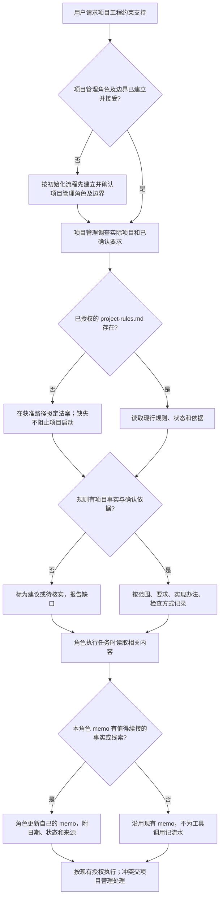

# 项目法案与角色备忘录支持

本功能帮助技能使用者在具体项目中建立一份所有角色共读的工程法案，并让每个角色保留少量下次工作有用的线索。项目工程法案说明这个项目确认采用的线程、代码组织、依赖、数据、资源、错误和验证做法；角色 memo 只服务于本角色续接。它们不替代项目目标方案、架构说明或任务记录。

项目管理角色在自己的角色目录下、已授权的 `docs/project-rules.md` 路径维护唯一法案。每个角色都从项目管理角色卡或正式文档引用这份相同的实际路径，不各自新建法案，并读取自己的 `memo.md`。每条规则使用稳定编号或名称，理由按需补充；规则要基于项目事实并标明草稿、待确认或已生效状态。指南用 GUI `THREAD-01` 示范范围、要求、实现和检查四项如何写成可操作的工程做法，并说明单纯加 `async` 不会把重计算移到后台。只有项目确认采用 GUI 主线程模型及相应约束后，这条例子才适用；它不默认禁止所有项目的主线程工作。Memo 记录事实、待办和续接线索，附日期、状态与依据，不复制全局规则或当前任务状态。

执行角色开始或续接相关工作时，查看自己的 memo 和法案相关条目；只有标为已确认且适用的规则才作为项目级约束。法案缺失或仍是草稿时，角色如实说明，并继续遵守通用技能和项目已有确认。发现旧代码冲突时只报告冲突和影响，由项目管理安排，不要求顺手迁移全项目。新增规则通过项目管理现有评审和确认流程；memo 本身不会建立新规则。

**失败与限制：**如果法案路径尚未进入项目管理边界，项目管理不能自行写入，应由治理流程处理边界。如果依据、确认状态或检查方式缺失，法案记录该缺口，执行与测试报告不能宣称规则已生效或已通过。各角色只能维护自己的 memo，具体权限仍以各自边界为准。

## 历史

- 2026-10-10 · 已实现；最终独立文档与情境验证完成，真实应用行为未测 · 新增法案与 memo 指南、技能接入和使用流程；见[变更记录](../change/2026-10-10_change_project-rules-memo.md)及[最终独立测试报告](../../../测试/docs/change/2026-10-10_change_project-rules-memo-validation.md)。报告记录 35 份 Markdown、238 个本地链接与锚点、5 份元数据检查通过；GUI、线程和应用性能未测。
