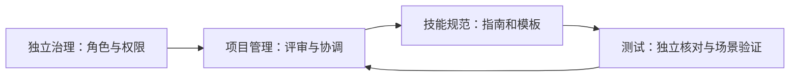

# ANS 项目架构与本轮角色配合

ANS 当前由通用技能规则、任务执行工具、可选图谱和 Dashboard/同步能力组成。源码沿用现有目录。这个页面先记录本轮正式建立的角色与它们怎样完成工程法案、备忘录支持。

- [项目工程法案](project-rules.md)：本项目已确认的工程约束。
- [技能规范功能导航](../../技能规范/feature-map.md)：由规范角色建立并维护。
- [本轮方案评审与分工](design/2026-10-10_design_project-rules-memo-review.md)。

当前受派的角色只获得本轮具体文档路径。云端、执行协作、可视化等其他能力的完整分工仍以[此前候选方案](../../../doc/design/2026-09-30_design_ans-project-roles.md)为后续依据，不因为这张图而自动取得全部源码权限。
